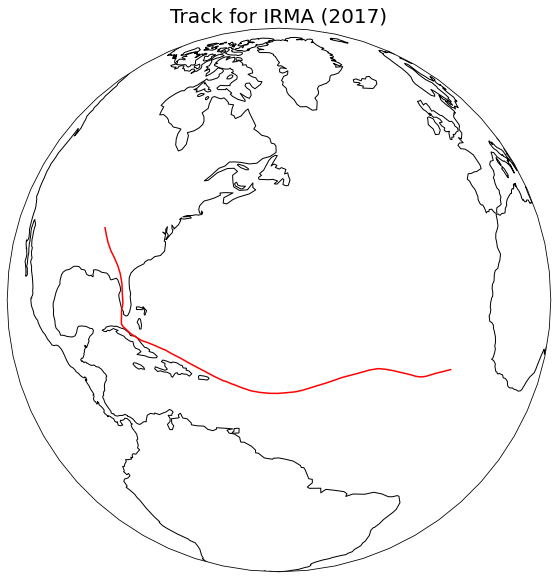
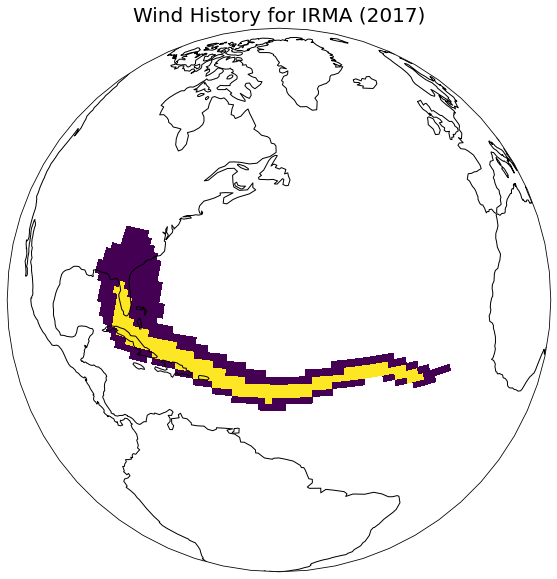
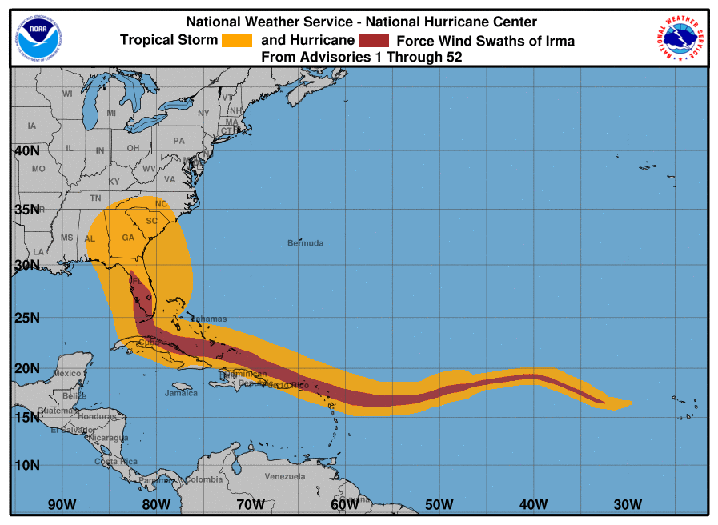
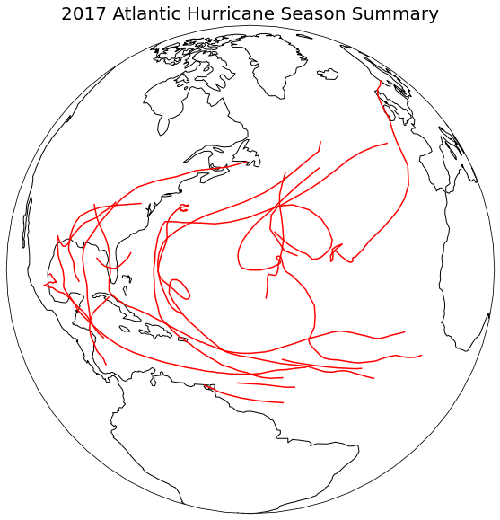
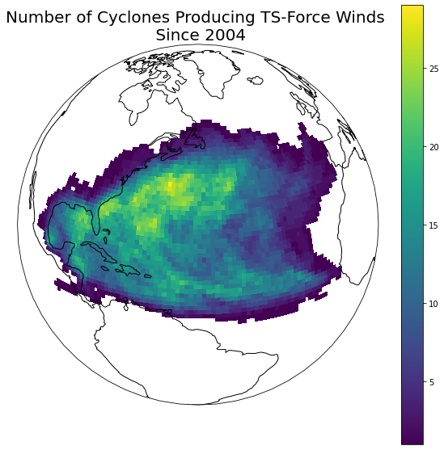
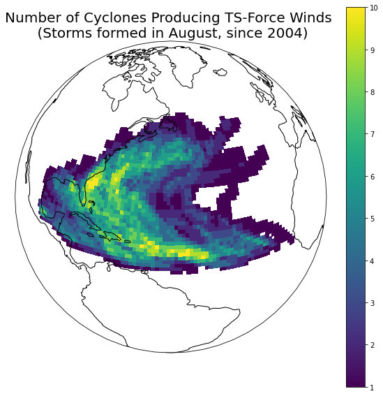
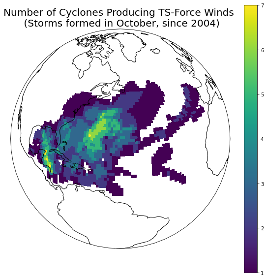

# hurricane-frequency

This is a project I have taken on to gain experience in using Python and Pandas for data cleaning, processing, and visualization. Having lived my entire life in the Southeastern United States, many years of which were in Florida, I've always had an interest in forecasting tropical cyclones and the factors that drive their development and behavior.

This project uses the HURDAT2 dataset from [NOAA's NHC Data Archive](https://www.nhc.noaa.gov/data), an archival dataset of best-track data describing the geographic position of the center of each tropical cyclone since consistent recordkeeping began in 1851. This dataset also includes information pertaining to the extent from the center of tropical storm- and hurricane-strength winds in the cyclone.

My goal in this investigation is to practice cleaning and producing visualizations using this data, and to investigate factors which affect the frequency by which particular geographic areas experience the effects of tropical cyclones.

I have kept a record of my learning in a series of Jupyter Notebooks (in `/notebooks/`). I have created (an excessive number of) modules to organize the code I wrote to process the data and produce visualizations in `/src/`.

The structure for this project was adapted from [the Cookiecutter Data Science project structure](https://drivendata.github.io/cookiecutter-data-science/).

Please note that some imports will no longer work if running the notebooks within the `/notebooks/` directory because definitions of defaults for dataset files in the modules are dependent on the working directory being the root of this project; moving the notebooks will likely work, but they are intended to be read primarily as reference materials now.

### Data cleaning

The HURDAT2 dataset contains rows of position data for storms interspersed with header rows to help identify which storm the position data pertains to. Cleaning the data involved separating these rows into two separate datasets and adding/changing columns where necessary.


```python
import os, sys
import pandas as pd
import numpy as np

from src.d01_data.data_download import download_atlantic_hurdat_raw
from src.d02_intermediate.clean_hurdat import partition_hurdat


download_atlantic_hurdat_raw()
partition_hurdat("Atlantic.csv")
```

    Downloaded data to /data/01_raw/Atlantic.csv
    Partitioned Atlantic.csv into:
     /data/02_intermediate/Atlantic_positions.csv
     /data/02_intermediate/Atlantic_storms.csv


```python
positions = pd.read_csv('data/02_intermediate/Atlantic_positions.csv')
storms = pd.read_csv('data/02_intermediate/Atlantic_storms.csv')
```

### Storm Paths

One set of functions I've written can take the unique identifier for a storm (stormID) and plot the path of the storm and the wind history chart on a map.


```python
from src.d07_visualization import storm_tracks as trk
from src.d07_visualization import wind_history as wh

irma = trk.stormID("Irma", 2017)
trk.plot_storm_track(irma, positions, storms, global_view = True, export = False)
wh.wind_history(irma, positions)
```


    

    


    

    


In my opinion, though much lower resolution, this graphic compares favorably with the official graphic (shown below for comparison), indicating my implementation is effective.




### Season Summary

Additionally, I wrote a function that can produce a season summary when provided a year.


```python
trk.plot_season_summary(2017)
```


    

    


### Historic Wind Frequencies

With respect to data products that provide more insight, most interesting is the wind frequency map. This graphic accumulates data for all storms for which wind extent data is available (storms after 2004). The globe is divided in to 1-degree x 1-degree cells, and the heat map indicates how many of the storms since 2004 produced wind that affected a given cell.


```python
from src.d03_processing import frequency as fr
frequency_matrix = fr.wind_frequency()

wh.heatmap(frequency_matrix, subtitle = "Since 2004")
```


    

    


We can see a lot of interesting information in this graphic; keeping in mind that this particular product holds only for storms since 2004, some of the relevant observations:
- The common starting location for classical "Cape Verde" storms is clearly visible off the coast of West Africa.
- The common path from Caribbean to Gulf storms is also present.
- The general curvature to the North and then East of the path of storms in the Central Atlatic is also visible.
- Some locations such as the coast of the Carolinas and the North Central Atlantic experienced upward of 25 storms producing tropical storm-strength winds or greater in the period since 2004.

#### Comparison between months

By passing smaller subsets of storms into the function (as a list of stormIDs), we can compare historically which areas were more frequently affected by different types of storm (e.g., which areas were more likely to be affected by August storms vs. October storms).


```python
august_storms = storms['stormID'][(storms['month_formed'] == 8) & (storms['year'] >= 2004)]
october_storms = storms['stormID'][(storms['month_formed'] == 10) & (storms['year'] >= 2004)]

august_frequency = fr.wind_frequency(august_storms)
october_frequency = fr.wind_frequency(october_storms)

wh.heatmap(august_frequency, subtitle = "(Storms formed in August, since 2004)")
wh.heatmap(october_frequency, subtitle = "(Storms formed in October, since 2004)")
```


    

    


    

    


These graphics, too, are interesting- for example, we can note the trend that August storms seem most likely to have been "Cape Verde" storms or storms formed in the mid-Atlantic, whereas October storms appear more likely to originate in the Caribbean!

## Further exploration

I would like to examine additional factors that affect the frequency of storms in particular regions, and to formalize these factors in a model, perhaps incorporating spatially-weighted regression.
